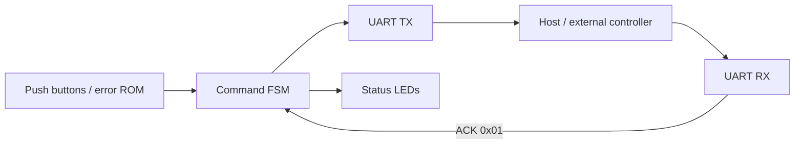

# FPGA UART Command Controller

Academic Master's coursework project demonstrating a compact **VHDL control path for an Intel/Altera Cyclone 10 LP FPGA**, including custom UART TX/RX logic, a command FSM, ROM-backed error samples, ACK handling, board I/O, and a host-side serial utility.

> **Portfolio classification:** academic / coursework prototype — not commercial experience.

## What this project demonstrates

- VHDL RTL design and finite-state-machine control;
- UART transmit/receive modules with parameterized clock and baud rate;
- FPGA/host serial integration;
- simple byte-level command protocol and ACK handshake;
- Cyclone 10 LP / Quartus project configuration;
- testbench-oriented design and separation of authored RTL from generated tool output.

## Architecture



## Repository layout

```text
rtl/                    Authored VHDL modules
sim/                    UART loopback testbench
tools/                  Host-side serial ACK utility
 docs/protocol.md        Byte protocol and ACK description
projFinal.qpf/.qsf       Lean Quartus project configuration
```

## Target configuration

- FPGA family: **Cyclone 10 LP**
- device: **10CL025YU256I7G**
- original toolchain: **Quartus Prime 18.1 Lite**
- default UART: **115200 baud**
- controller reset and board push buttons are active-low in the current design.

## RTL notes

The portfolio version improves the original academic snapshot by:

1. making clock frequency and baud rate controller generics;
2. separating TX start, TX-busy assertion, TX completion, and ACK wait into explicit FSM states;
3. replacing fixed `COM10` host code with a configurable CLI;
4. removing Quartus databases, generated IP trees, simulation caches, backups, and the Python virtual environment;
5. keeping generated/vendor artifacts out of source control.

## Host-side demo

```bash
python -m venv .venv
# Linux/macOS: source .venv/bin/activate
# Windows: .venv\\Scripts\\activate
pip install -r requirements.txt
python tools/serial_ack.py COM10
# or: python tools/serial_ack.py /dev/ttyUSB0
```

The host tool prints each received command byte and responds with ACK `0x01`.

## Simulation

`sim/tb_uart_loopback.vhd` performs a UART TX->RX loopback using byte `0x55` and is written for VHDL-2008-compatible simulators. Example GHDL flow:

```bash
ghdl -a --std=08 rtl/uart_tx.vhd rtl/uart_rx.vhd sim/tb_uart_loopback.vhd
ghdl -e --std=08 tb_uart_loopback
ghdl -r --std=08 tb_uart_loopback
```

## Protocol

See [`docs/protocol.md`](docs/protocol.md). The current one-byte protocol is intentionally simple and academic; a production design would add framing, timeout/retry logic, integrity checks, and stronger fault handling.
